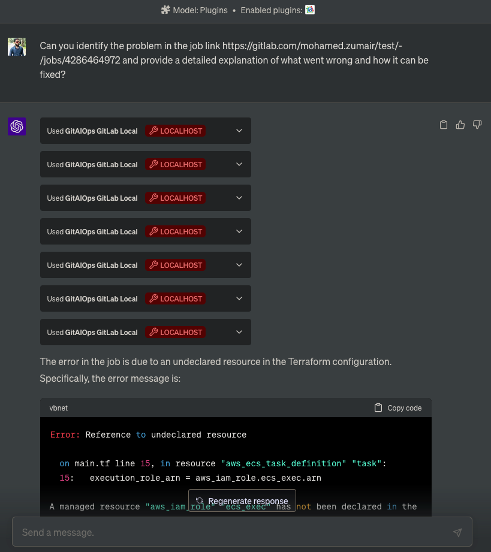
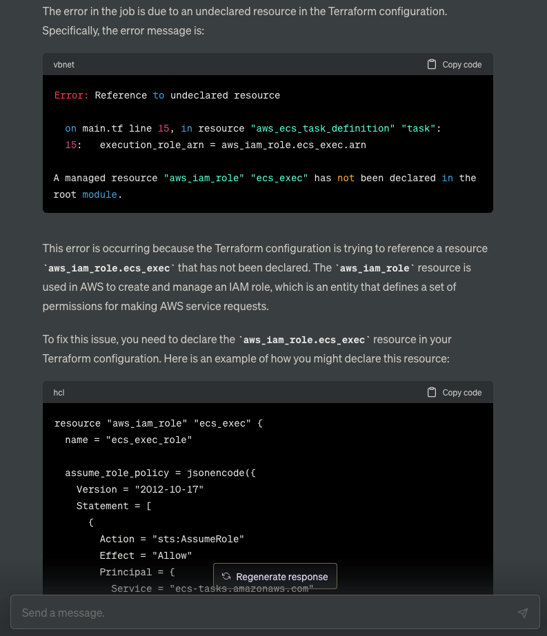
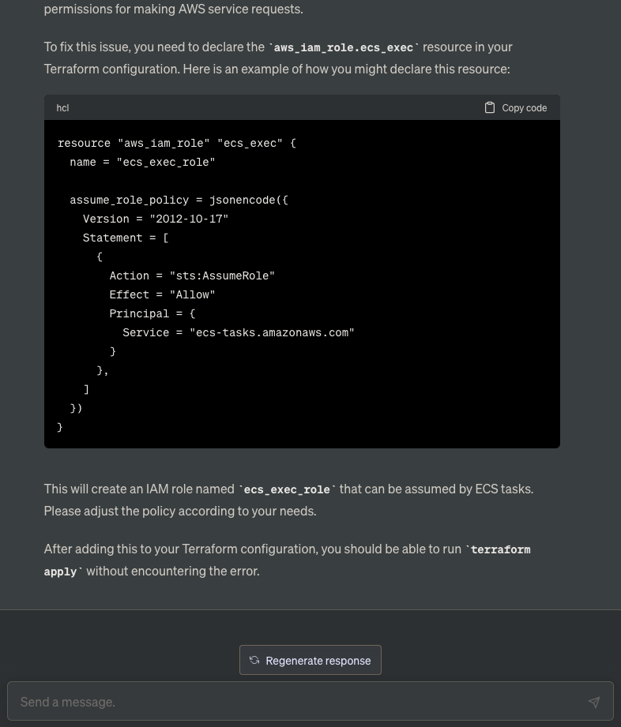

# Debugging Pipeline Error

In this example, we asked ChatGPT to identify the problem in a specific GitLab job and provide a detailed explanation of what went wrong and how it can be fixed. 

The prompt used was:

> "Can you identify the problem in the job link [job link] and provide a detailed explanation of what went wrong and how it can be fixed?"

The conversation screenshots below show how ChatGPT interacted with the GitAIOps plugin to fetch the job logs and analyze the error.

1. User asking ChatGPT to debug the pipeline error.
    

2. ChatGPT use GitAIOps plugin to fetches the job logs in pagination and identifies the error.
    

3. ChatGPT provides a detailed explanation of the error and suggests a potential fix.
    

This example demonstrates how ChatGPT, with the help of the GitAIOps plugin, can assist in debugging CI/CD pipeline errors by fetching and analyzing job logs.
