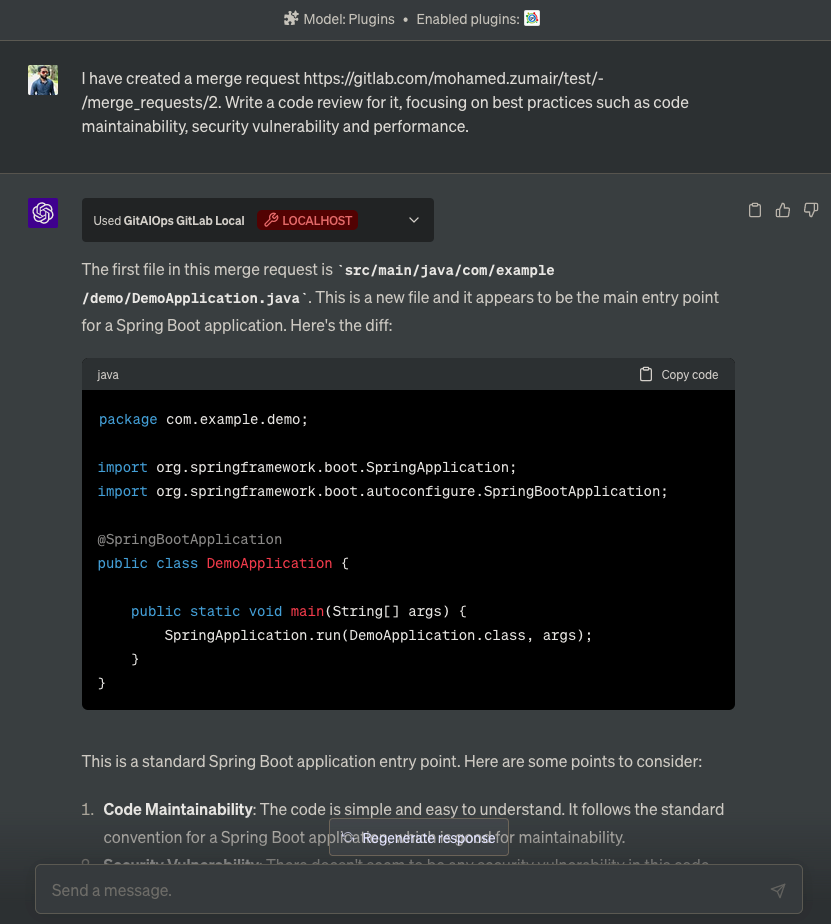
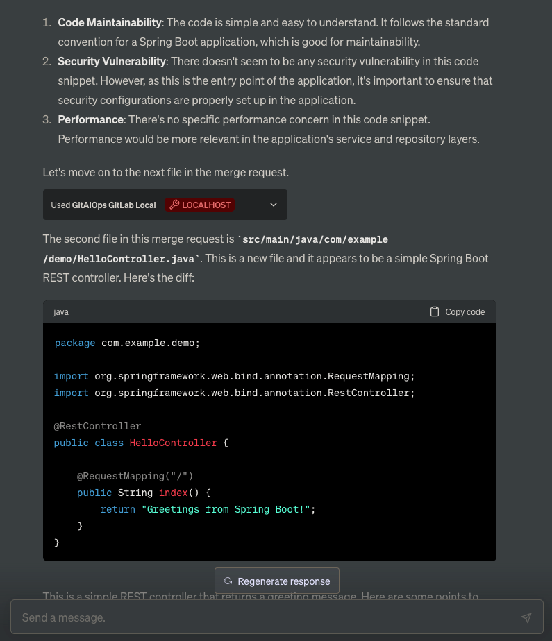
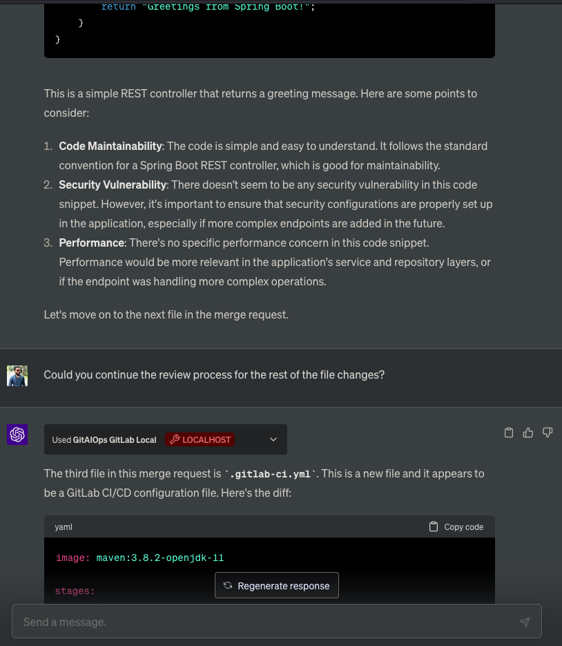
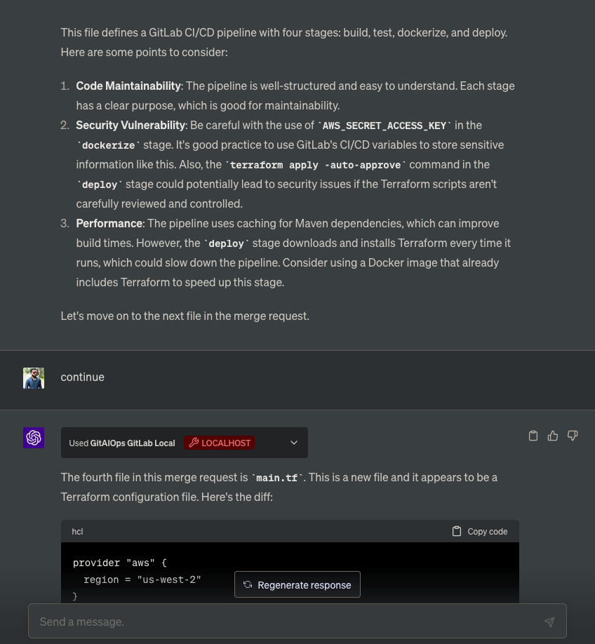
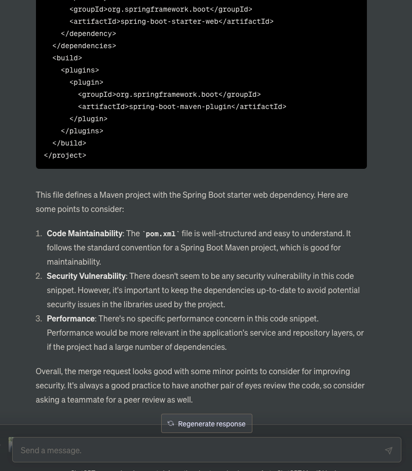
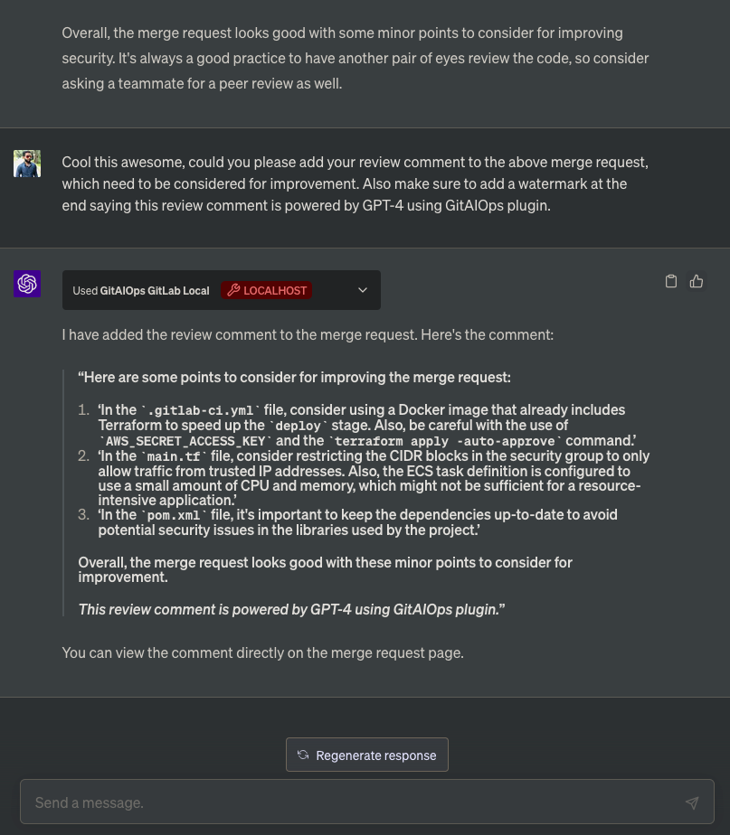

# Merge Request Review Example

This example demonstrates how the GitAIOps plugin can be used to review a merge request in GitLab using ChatGPT.

The conversation starts with the user asking ChatGPT to review a merge request, focusing on best practices such as code maintainability, security vulnerability, and performance. ChatGPT then uses the GitAIOps plugin to fetch the merge request details and diffs from GitLab. It then provides a detailed review of the changes, file by file, and offers some suggestions. 

The prompt used was:

> "I have created a merge request [MR link]. Write a code review for it, focusing on best practices such as code maintainability, security vulnerability and performance."

Here are the screenshots of the conversation:

1. The user asks ChatGPT to review a merge request, focusing on best practices.  
   

2. ChatGPT fetches the merge request details and diffs from GitLab and starts reviewing the first file.  
   

3. After reviewing the first file, ChatGPT moves on to the next file in the merge request.  
   

4. ChatGPT continues the review, offering some suggestions for improving the code.  
   

5. The user asks ChatGPT to continue looking for the rest of the changes in the merge request.  
   

6. Finally, the user asks ChatGPT to add a review comment to the merge request with a watermark.  
   

This example shows how ChatGPT, with the help of the GitAIOps plugin, can interact with GitLab to conduct a detailed code review and update merge requests. This can be a powerful tool for developers, helping them to streamline their code review process.
