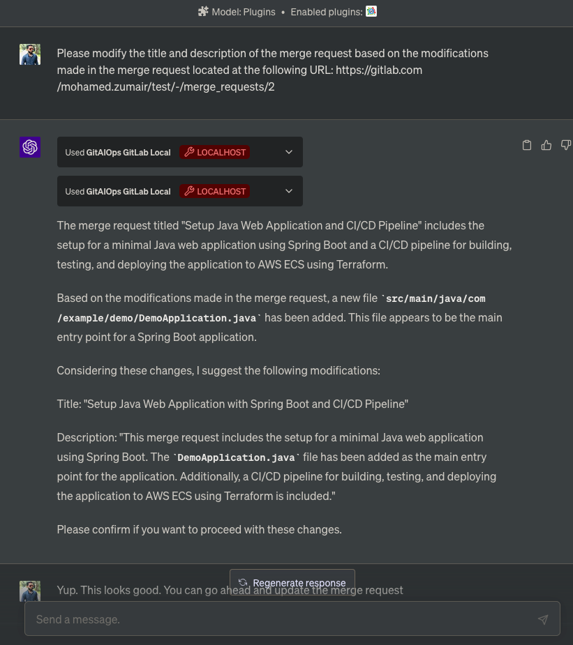
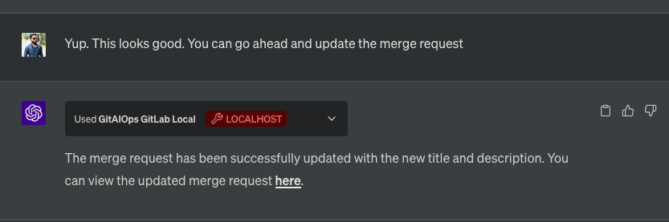

# Updating Merge Request Details

In this example, we asked ChatGPT to modify the title and description of a merge request based on the modifications made in the merge request. 

The prompt used was:

> "Please modify the title and description of the merge request based on the modifications made in the merge request located at the following URL: [mr link]"

The conversation screenshots below show how ChatGPT interacted with the GitAIOps plugin to fetch the current merge request details, analyze the changes, and update the title and description.

1. The user asked to update the merge request details. ChatGPT fetches the current merge request details and the changes made in the merge request, and then suggests a new title and description.
    

2. The user confirming the suggested changes. ChatGPT then proceeds to update the merge request details using the GitAIOps plugin.
    

This example demonstrates how ChatGPT, with the help of the GitAIOps plugin, can assist in managing merge requests by updating their details based on the changes made.
